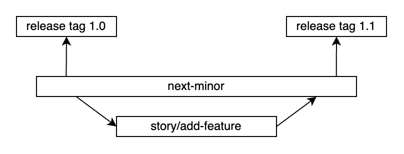
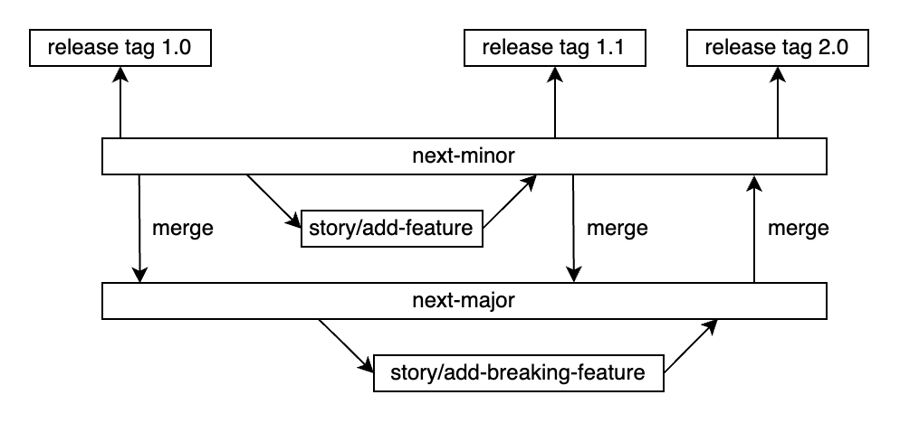
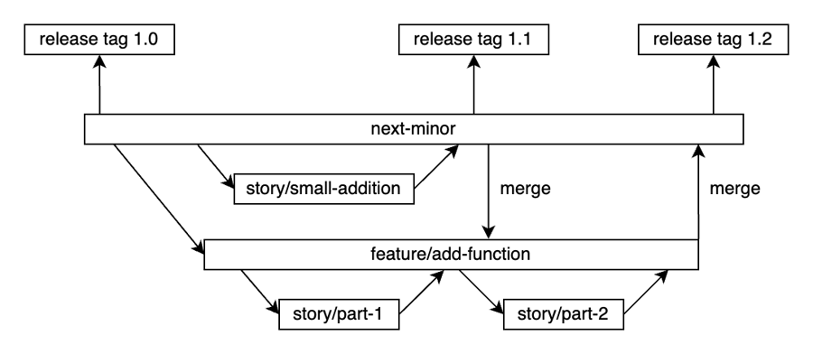

Contributing to NL Portal Frontend libraries
-------------------------------------

Thank you for your interest in contributing to NL Portal Frontend libraries.

When contributing to this repository, please first discuss the change you wish
to make with the owners of the repository.
You can discuss the change via [Issues](https://github.com/nl-portal/nl-portal-frontend-libraries/issues).

## Ownership

This project is owned by [Ritense](https://ritense.com/).

## Instructions for contributing

1. [Request For Change](https://github.com/nl-portal/nl-portal-issues) for bigger features or repository specific
   [issues](https://github.com/nl-portal/nl-portal-frontend-libraries/issues) for smaller tasks/bugs
2. Proposal is discussed and added to the above rfc/issue
3. Code is written
4. Pull request to relevant branch (See [Branching and workflows](#branching-and-workflows))
5. **optional** release snapshot

## Branching and workflows

### `next-minor`

The nl-portal-backend-libraries is mainly developed in one single branch: `next-minor`. As its name
implies, alle commits made into `next-minor` will be included when the next minor version of the product
is released.

### `next-major`

Breking changes are developed in the `next-major` branch. Only changes related to the breaking changes
are made here. Unrelated changes are still commited to `next-minor`.

`next-minor` is frequently merged into `next-major`, in order to avoid future merge conflicts.

Once the breaking changes in `next-major` are finished and tested, `next-major` is merged
into `next-minor`. The merge commit is then tagged and released. The branch `next-major` is not
deleted after this merge and release.

Work then continues in the `next-minor` branch until a new breaking change needs to be made, which
will again be developed in the `next-major` branch.

### feature, bugfix and hotfix branches

#### Features
Because of security reasons back-end features are developed into feature branches, branched off
from `next-minor`. Feature branches are named `feature/*`. parts of the feature are developed in
branches prefixed with `story/`, which include a story number when available. For example:
`story/add-endpoint` or `story/12345-add-endpoint`. These story branches are merged into the feature
branch as soon as possible. In addition, `next-minor` is merged frequently into the feature branch.

#### Bugfixes

Bugfix branches follow the naming scheme: `bugfix/fix-security` or `bugfix/12345-fix-security`.
They are either merge into `next-minor`, `feature/*` or `next-major`.

#### Hotfixes

Hotfix branches are similar to bugfixes, but are written in `hotfix/*`. These are based on and used
for a `release/*` branch. They are only used when a patch is needed on a release that
can not wait for the `next-minor` version. The pull request is later merged back into `next-minor`
and `next-major`.

## Workflows

Github workflows are used to validate, build and publish code.

